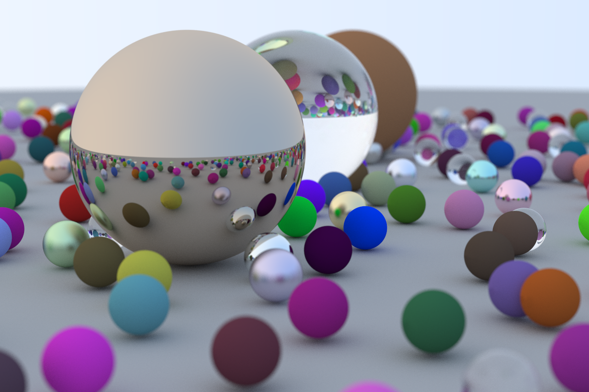

# Ray Tracing in One Weekend
Following the wonderful tutorial: https://raytracing.github.io/books/RayTracingInOneWeekend.html

Final image:


## Basic image

(C++)
```c++
// executable directroy

mkdir exe
// Compile
g++ -std=c++11 <file>.cpp -o exe/render

./exe/render > image.ppm
```


(Rust)
```rust
cargo run > image.ppm
```
